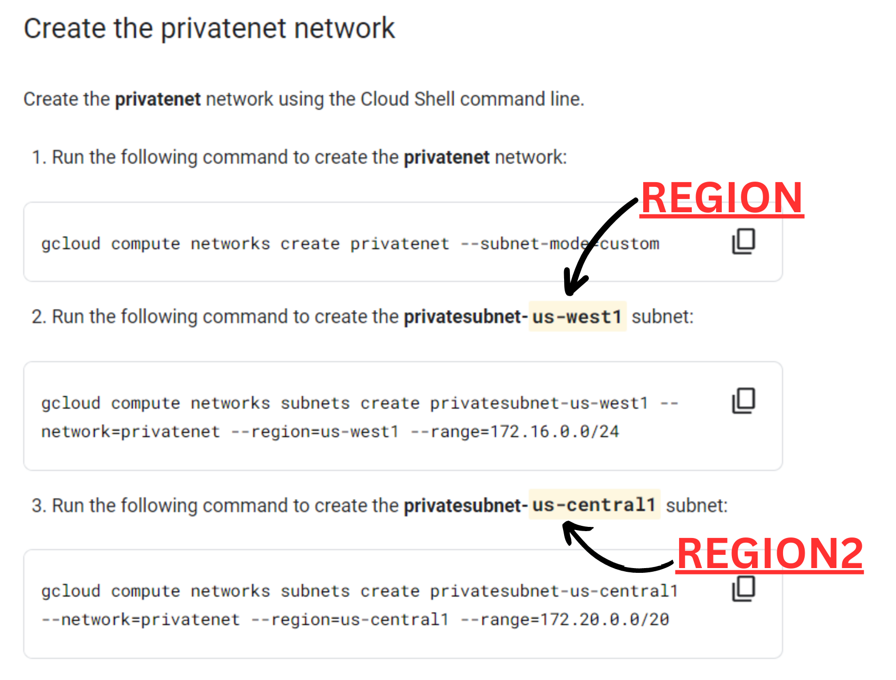

## Lab Name - *Multiple VPC Networks [GSP211]*

## Lab Link - [Click Here](https://www.cloudskillsboost.google/focuses/1230?parent=catalog)

## [YouTube Solution Link](https://youtu.be/YUTiL0ojLy0)
Run the following commands in the Cloud Shell Terminal.

```
export REGION=
```

```
export REGION2=
```

```
export ZONE=
```


## Task 1. Create custom mode VPC networks with firewall rules

```
gcloud compute networks create managementnet --subnet-mode=custom

gcloud compute networks subnets create managementsubnet-$REGION --network=managementnet --region=$REGION --range=10.130.0.0/20
```

```
gcloud compute networks create privatenet --subnet-mode=custom

gcloud compute networks subnets create privatesubnet-$REGION --network=privatenet --region=$REGION --range=172.16.0.0/24

gcloud compute networks subnets create privatesubnet-$REGION2 --network=privatenet --region=$REGION2 --range=172.20.0.0/20

gcloud compute networks list
```

```
gcloud compute firewall-rules create managementnet-allow-icmp-ssh-rdp --direction=INGRESS --priority=1000 --network=managementnet --action=ALLOW --rules=tcp:22,tcp:3389,icmp --source-ranges=0.0.0.0/0

gcloud compute firewall-rules create privatenet-allow-icmp-ssh-rdp --direction=INGRESS --priority=1000 --network=privatenet --action=ALLOW --rules=icmp,tcp:22,tcp:3389 --source-ranges=0.0.0.0/0

gcloud compute firewall-rules list --sort-by=NETWORK
```

## Task 2. Create VM instances

```
gcloud compute instances create managementnet-$REGION-vm --zone=$ZONE --machine-type=e2-micro --network=managementnet --subnet=managementsubnet-$REGION

gcloud compute instances create privatenet-$REGION-vm --zone=$ZONE --machine-type=e2-micro --subnet=privatesubnet-$REGION
```

## Task 4. Create a VM instance with multiple network interfaces

```
gcloud compute instances create vm-appliance \
    --zone=$ZONE \
    --machine-type=e2-standard-4 \
    --network-interface=network-tier=PREMIUM,stack-type=IPV4_ONLY,subnet=privatesubnet-$REGION \
    --network-interface=network-tier=PREMIUM,stack-type=IPV4_ONLY,subnet=managementsubnet-$REGION \
    --network-interface=network-tier=PREMIUM,stack-type=IPV4_ONLY,subnet=mynetwork
```

# Congratulations🎉! You've completed this Lab.