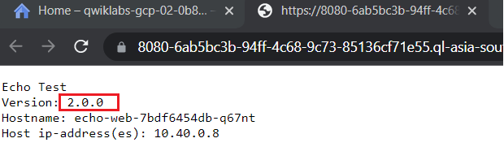

## `Lab Name` - *Scale Out and Update a Containerized Application on a Kubernetes Cluster [GSP305]*

## `Lab Link` - [*Click Here*](https://www.cloudskillsboost.google/focuses/1739?parent=catalog)

## YouTube Solution Link - To be Uploaded Soon

Run the below commands in the Cloud Shell Terminal.
```
export ZONE=
```

* Before starting this lab, we need to download and extract the source code of the application which is given in the lab instruction.

```
gsutil cp gs://$DEVSHELL_PROJECT_ID/echo-web-v2.tar.gz .
tar -xvf echo-web-v2.tar.gz
```

## Task 1: Build a echo-app:v2 tagged Docker Image & Push the image to the Google Container Registry

```
gcloud builds submit --tag gcr.io/$DEVSHELL_PROJECT_ID/echo-app:v2 .
```

## Task 2: Deploy the echo-app:v2 application image to the Kubernetes Cluster

```
gcloud container clusters get-credentials echo-cluster --zone $ZONE --project $DEVSHELL_PROJECT_ID

kubectl create deployment echo-web --image=gcr.io/$DEVSHELL_PROJECT_ID/echo-app:v2

kubectl expose deployment echo-web --type=LoadBalancer --port=80 --target-port=8000

kubectl scale deploy echo-web --replicas=2
```

## Task 4: Validate the application, It should working on v 2.0.0

```
kubectl port-forward service/echo-web 8080:80
```

After the above command, click on `web preview on port 8080` & you can see in your browser that it is showing `version: 2.0.0`



# Congratulations🎉! You're all done with this Challenge Lab.
